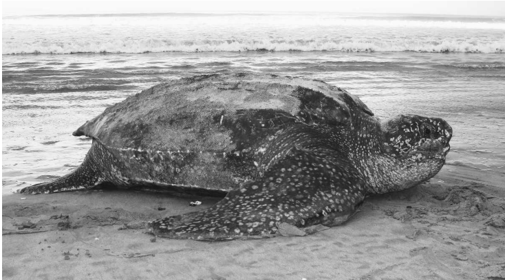

## This is a repository with example files for Barbour et al., *Clustering and classification of vertical movement profiles for ecological inference of behavior*.
 

 
**Leatherback photo by Dr. George Shillinger and sourced from Bailey et al. 2012.**

 

#### The goal of this repository is to provide example files and code to replicate the DTW (Dynamic Time Warp) and CNN (Convolutional Neural Network) analyses of Barbour et al. All DTW questions should be directed to Nicole Barbour at *nbarbour@umd.edu* and all CNN questions to Alexander Robillard at *RobillardA@si.edu*. Acknowledgements should include citations to the main paper and the code authors (Nicole Barbour for DTW analysis, Alexander Robillard for CNN analysis). Tracking data is owned by Upwell (https://www.upwell.org/) and originally published in Shillinger et al. (2008, 2010, 2011). Although users are welcome to adopt code to their purposes, no modifications may be made to original code, data, or this Github repository.
  

 
*Images of the 5 published dive profile shapes known for sea turtles performing pelagic movements (see Hochscheid 2014). Images for each type represent actual dives from the Barbour et al. dataset.*

 

#### The goal of the analyses presented in Barbour et al was to demonstrate how different machine learning techniques can be used together for clustering and classification of vertical (diving) movement profiles for sea turtles. We demonstrate our framework on the enigmatic and deep-diving Eastern Pacific (EP) leatherback turtle (*Dermochelys coriacea*), which is critically endangered due to interactions with fishing vessels at sea and particularly with drifting longline fishing gears at depth. Conservation of this species depends on accurate predictions of where, when, and in what environmental conditions turtles are performing specific behaviors at depth. However, previous habitat models for this population have only incorporated horizontal (surface) movements (Shillinger et al. 2011, Bailey et al. 2012). 
 

 
*Map of the two different clusters identified with the DTW analysis in Barbour et al. These two clusters were found to have different spatial and temporal distributions, average depths (Cluster 1- deeper, Cluster 2- shallower), and relationships with environmental covariates (sea surface temperature, chlorophyll-a, bathymetry, sea surface height deviation).*

 

Here, we used a Dynamic Time Warp (DTW) analysis (unsupervised machine learning) on 28,217 dives for N=31 EP leatherbacks to cluster dives by their quantitative metrics (dive depth and duration). We then used a Convolutional Neural Network (CNN) model (supervised machine learning) to classify dives within each cluster identified with the DTW by their general shape or profile. We trained our CNN on 5 published and known general dive shapes for sea turtles performing pelagic movements (Hochscheid 2014, Types A, C, D, E, and F), each of which can occur at a range of depths/durations but are indicative of different general behaviors (e.g., Type A, quick ascents/descents and prolonged bottom time). 

 

 
To further determine the ecological relevance of the clusters identified with the DTW, Generalized Additive Mixed Models (GAMMs) were used to determine relationships between each DTW cluster and previously identified important environmental covariates (e.g., sea surface temperature, chlorophyll-a, sea surface height, and water depth). 
 
Example code is only provided for the DTW and CNN analyses, as these are not as commonly used for movement ecology problems; GAMMs are more commonly applied in ecology and example code can be found elsewhere (see the "mgcv" R package and great book, Zuur et al., 2009, *Mixed Effects Models and Extensions in Ecology with R*). 
 

 
*Results of the CNN analysis applied in Barbour et al, showing the proportion of different dive shapes identified within each DTW cluster (Cluster 1, black- deeper, Cluster 2, orange- shallower).*

 

### Description of Files:

### This repository has folders for: example code ("Code") and data ("Data"). For descriptions of methods in general, please see Barbour et al. Otherwise, code files have comments throughout and for the DTW analysis portion, assume that users have intermediate R coding experience. Be sure that you have the most recent version of R and R Studio for the DTW analysis and Python for the CNN. 

Code files include:

 

  
 
  * **DTW_example.R**: Code to perform the DTW analysis, using the N=28,217 dives from Barbour et al. This is a large dataset and for example purposes, the data can be subset to a smaller sample size to decrease model run times.  
  * **CNN_Prep_example.R**: Code to prepare input data for CNN model, using the N=28,217 dives from Barbour et al. Will result in folders on your local computer ("training" and "master") that can be used with provided CNN Python code.
  * **Diveprofile_CNN-Final.ipynb**: Python code to run CNN model, using the "fast.ai" PyTorch package and the ResNet-34 architecture, a pre-trained CNN that can be tailored to a personal dataset and desired number of classes using "transfer learning".
  
  

 

